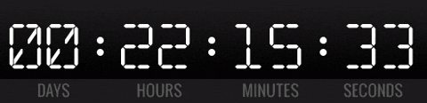

<div align="center">
  
</div>

# 🌐 Digital Clock Web App


A modern, responsive, and interactive **Digital Clock** web application built with **HTML, CSS, and JavaScript**.  
It displays **local time**, **selected country time**, and **date**, with **light/dark mode** support and **timezone-based country selection**.

---

## 📌 Table of Contents

- [✨ Features](#-features)
- [🎨 Demo](#-demo)
- [🌐 Live Demo](#-live-demo)
- [⚡ Installation](#-installation)
- [🛠 How to Use](#-how-to-use)
- [🛠 Technologies Used](#-technologies-used)
- [📄 License](#-license)
- [👤 Author](#-author)
- [🌍 Social Links](#-social-links)

---

## ✨ Features

<details>
<summary>✨ Click to expand Features</summary>

- ⏱ **Real-Time Digital Clock**  
  Shows hours, minutes, seconds, AM/PM, day of the week, and date.

- 🌍 **Country Time Selection**  
  Select a country from the dropdown to view its local time.  

- 💾 **Persistent Preferences**  
  Remembers your last selected **theme** (light/dark) and **country**, and restores them on page reload.

- 📱 **Responsive Design**  
  Fully responsive on desktops, tablets, and mobile devices.

- 🌗 **Light/Dark Mode**  
  Toggle between light and dark themes. Smooth transitions with a user-friendly interface.

- 🌐 **Offline/Online Support**  
  Works offline using device local time and online with timezone-based selection.

- 🇧🇩 **Flags & Timezones**  
  Dropdown includes country names with flags and **IANA** timezone support.

</details>

---

## 🎨 Demo

<details>
<summary>Click to expand Screenshots</summary>

### Light Mode


### Dark Mode


</details>

---

## 🌐 Live Demo

[](https://abdurrahman101bd.github.io/Digital-Clock)

---

## ⚡ Installation


1. **Clone the repository:**

```bash
git clone https://github.com/abdurrahman101bd/Digital-Clock.git
```
2. **Navigate to the project folder:**
```bash
cd Digital-Clock
```
3. **Open index.html in your browser:**
```bash
index.html
```

---

## 🛠 How to Use

<details>
<summary>Click to expand Usage Instructions</summary>

1. **Open the app in your browser.**
2. **View your local device time by default.**
3. **Select a country from the dropdown to view its time.**
4. **Toggle light/dark mode using the top-right button.**

</details>

---

## 🛠 Technologies Used

💻 HTML5

🎨 CSS3 (responsive & dark mode)

⚡ Vanilla JavaScript

🌐 IANA Timezone Database


---


## 📄 License

This project is licensed under the [MIT License](#-license).
Feel free to use, modify, and distribute.


---

## 👤 Author

[](https://github.com/abdurrahman101bd)
[](mailto:abdurrahman101bd@gmail.com)

---

### 🌍 Social Links

Connect with me on **social** platforms:

[](https://github.com/abdurrahman101bd)[](https://www.linkedin.com/in/abdurrahman101bd)[](https://x.com/abdurrahman101b)  [](https://www.facebook.com/abdurrahman101bd)  

---

⌛ Enjoy your **Digital Clock!**

---
